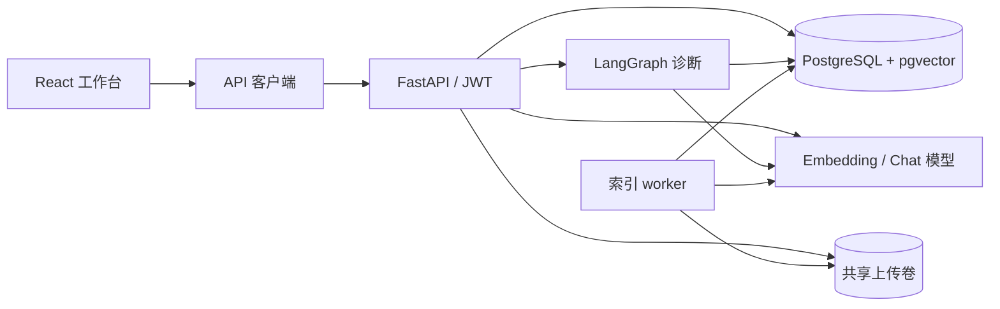

# Enterprise Agent Platform

一个可运行、可审计的企业知识检索与订单诊断 Agent 示例。项目展示从文档上传、异步索引、租户隔离检索到带来源引用的回答，以及由 LangGraph 编排的受限业务工作流。业务数据和规则均为虚构示例。

## 能力一览

| 能力 | 实现与边界 |
| --- | --- |
| 文档处理 | TXT、Markdown、文本型 PDF；手动实现与 LangChain 实现可按索引任务切换，输出相同的解析和分片契约 |
| 持久化索引 | PostgreSQL 任务租约、失败重试、版本原子发布；pgvector 存储 1536 维向量，支持 OpenAI 兼容 Embedding 接口 |
| 租户隔离 | RS256 JWT 中的 `tenant_id` 决定访问范围；知识库、检索、订单和运行轨迹均按租户查询 |
| 检索与问答 | 仅检索已发布版本及当前 Embedding 向量空间；同步和 SSE 流式问答共用服务端引用校验，证据不足时拒答 |
| 订单诊断 | LangGraph 固定路由、只读订单工具、步骤轨迹、token 用量与固定合成数据评测 |
| 请求可观测性 | 响应关联 ID、脱敏结构化访问日志；诊断运行另有持久化步骤轨迹 |
| 运行保护 | 模型请求并发容量门、快速可重试的 503、模型阶段超时 |
| Web 工作台 | React、TypeScript、Vite、Ant Design；租户初始化、知识库与文档管理、索引状态、流式问答、订单诊断和管理员运行轨迹 |

`manual` 与 `langchain` 文档处理器通过同一接口接入；LangChain 同时用于 Embedding、结构化模型调用，LangGraph 用于工作流。框架被放在适配层，任务、权限和索引版本规则保留在业务层。



## 快速开始

需要 Python 3.12、Docker Engine、Docker Compose v2 和 OpenSSL。以下命令在仓库根目录执行；索引、检索、问答和诊断需要可用模型。默认配置使用 OpenAI API 密钥；也可按 [模型接入说明](docs/MODEL_PROVIDERS.md) 分别接入 Ollama 或其他兼容网关。复制配置后，在本机编辑 `.env`；`.env` 和私钥已被 Git 忽略。

```bash
cp .env.example .env
mkdir -p config
openssl genpkey -algorithm RSA -pkeyopt rsa_keygen_bits:2048 -out config/auth-private.pem
openssl pkey -in config/auth-private.pem -pubout -out config/auth-public.pem
docker compose up -d --build
curl -fsS http://127.0.0.1:8000/api/v1/health
```

健康检查应返回 `{"status":"ok"}`。交互式 API 文档位于 [http://127.0.0.1:8000/docs](http://127.0.0.1:8000/docs)。Compose 启动 PostgreSQL、一次性迁移任务和 API；索引 worker 单独启动：

```bash
docker compose --profile indexing up -d indexer
```

建立演示租户、上传规则、等待索引并提问。以下变量由响应自动提取，无需手动替换 ID。演示 Token 有效期一小时，私钥只在本机使用；部署时应由身份服务签发 JWT。

```bash
TENANT_ID=$(python3 -c 'import uuid; print(uuid.uuid4())')
TOKEN=$(python3 backend/scripts/dev_token.py --subject demo-user --tenant-id "$TENANT_ID")
curl -fsS -X POST http://127.0.0.1:8000/api/v1/tenants \
  -H "Authorization: Bearer $TOKEN" -H 'Content-Type: application/json' \
  -d '{"name":"Demo tenant"}'

KB_ID=$(curl -fsS -X POST http://127.0.0.1:8000/api/v1/knowledge-bases \
  -H "Authorization: Bearer $TOKEN" -H 'Content-Type: application/json' \
  -d '{"name":"Refund policies"}' |
  python3 -c 'import json,sys; print(json.load(sys.stdin)["id"])')
DOC_ID=$(curl -fsS -X POST "http://127.0.0.1:8000/api/v1/knowledge-bases/$KB_ID/documents" \
  -H "Authorization: Bearer $TOKEN" \
  -F 'file=@./examples/refund_policy.md;type=text/markdown' |
  python3 -c 'import json,sys; print(json.load(sys.stdin)["id"])')
curl -fsS -H "Authorization: Bearer $TOKEN" \
  "http://127.0.0.1:8000/api/v1/documents/$DOC_ID/index-jobs"
```

索引任务显示 `SUCCEEDED` 后运行：

```bash
curl -fsS -X POST "http://127.0.0.1:8000/api/v1/knowledge-bases/$KB_ID/ask" \
  -H "Authorization: Bearer $TOKEN" -H 'Content-Type: application/json' \
  -d '{"query":"退款需要谁批准？"}'
curl -N -X POST "http://127.0.0.1:8000/api/v1/knowledge-bases/$KB_ID/ask/stream" \
  -H "Authorization: Bearer $TOKEN" -H 'Content-Type: application/json' \
  -d '{"query":"退款需要谁批准？"}'
docker compose run --rm migrate python scripts/seed_demo_orders.py --tenant-id "$TENANT_ID"
curl -fsS -X POST "http://127.0.0.1:8000/api/v1/knowledge-bases/$KB_ID/diagnose" \
  -H "Authorization: Bearer $TOKEN" -H 'Content-Type: application/json' \
  -d '{"question":"DEMO-WINDOW 为什么退款失败？","order_id":"DEMO-WINDOW"}'
```

诊断结果的 `run_id` 可供租户管理员查询 `/api/v1/agent-runs/{run_id}`。使用 `docker compose --profile indexing down` 停止服务；命名卷中的数据库和上传文件默认保留。

### Web 工作台

需要 Node.js 22。API 与索引 worker 启动后，在另一个终端运行：

```bash
cd frontend
npm ci
cp .env.example .env.local
npm run dev
```

打开 Vite 输出的本机地址。开发服务器将 `/api` 代理至 `http://127.0.0.1:8000`。如需使用本机演示 JWT，把 `frontend/.env.local` 中的 `VITE_DEV_TOKEN_AUTH` 改为 `true`，刷新页面，然后粘贴上面 `backend/scripts/dev_token.py` 签发的 token。这个入口只在 Vite 开发模式出现；token 仅保存在当前页面内存，刷新或退出即清除。演示 token 一小时后过期，届时需重新签发。前端会引导管理员创建未开通的租户，也可以直接使用上面的 API 步骤。

“订单诊断”页使用合成订单数据；先按上面的 `seed_demo_orders.py` 命令为当前租户写入演示订单。诊断接口是同步响应，页面会显示执行中状态，完成后展示业务事实、知识库引用；管理员可在“运行轨迹”页查看步骤摘要、耗时和 token 用量。

如需对接企业 OIDC，在 `frontend/.env.local` 配置 `VITE_OIDC_AUTHORITY`、`VITE_OIDC_CLIENT_ID` 和可选的 `VITE_OIDC_SCOPE`。客户端使用 Authorization Code + PKCE，回调地址为 `<前端地址>/auth/callback`。身份服务还须签发后端接受的 RS256 JWT，包含 `sub`、`tenant_id`、`role`、`iss`、`aud`、`iat` 和 `exp`，并配置相同的签名公钥、issuer、audience；仅配置前端 OIDC 地址无法完成后端认证。生产环境需将 `/api` 与前端设为同源，或在可信反向代理中转发 API 请求。

## 开发与质量检查

本地安装：在 `backend/` 使用 Python 3.12 创建虚拟环境并运行 `pip install -e '.[test]'`。复制 `.env.example` 后，`DATABASE_URL` 指向宿主机 PostgreSQL；测试用户需要创建数据库和 `vector` 扩展的权限。

```bash
cd backend
ruff check app tests scripts alembic
ruff format --check app tests scripts alembic
alembic upgrade head
alembic check
pytest -q
```

CI 在 pgvector PostgreSQL 上执行迁移、迁移漂移检查、静态检查、格式检查和数据库集成测试，同时构建后端镜像。测试使用确定性的假模型；[版本化 RAG 与 Agent 基准](docs/AGENT_TRACES_EVAL.md)可在显式启动模型后生成可比较的检索、引用、拒答和跨租户报告。另有冻结的留出集与逐指标质量门槛。有界词项重排后，DeepSeek 的留出集检索已达到 7/7，但问答精确来源仍为 5/6，未通过预设门槛；逐例结果与限制见评测文档。合成数据集不能代表真实业务质量。

前端检查使用 `cd frontend && npm run typecheck && npm run lint && npm run test && npm run build`。`backend/scripts/export_openapi.py` 导出后端契约，`npm run generate:api` 更新 TypeScript 类型；CI 检查两个生成文件与后端路由一致。

在 macOS Docker Compose 中接入宿主机 Ollama 时，按[模型接入说明](docs/MODEL_PROVIDERS.md#macos-docker-compose-与宿主机-ollama)配置可达地址，并运行 `backend/scripts/smoke_compose_models.py` 验证 Embedding、容器索引 worker、检索、问答及诊断。

## 设计与限制

- [代码边界与扩展点](docs/ARCHITECTURE.md) · [产品范围](docs/PRODUCT_SPEC.md) · [模型接入](docs/MODEL_PROVIDERS.md) · [租户隔离](docs/TENANCY.md) · [索引状态机](docs/INDEXING.md) · [检索](docs/RETRIEVAL.md) · [带引用问答](docs/CITED_QA.md) · [诊断工作流](docs/DIAGNOSTIC_WORKFLOW.md)
- [请求级可观测性](docs/OBSERVABILITY.md) · [运行轨迹与评测](docs/AGENT_TRACES_EVAL.md)
- [模型请求运行保护](docs/RUNTIME_PROTECTION.md)
- PDF 只提取文本，不含 OCR。默认上传上限为 10 MiB；上传文件保存在共享卷。生产部署还应在入口网关限制请求体大小。
- 引用校验确认来源属于本次授权检索结果，不能证明回答的每一句话在语义上成立。高风险结论仍需人工审核。
- 运行轨迹包含原问题与最终回答；应限制管理员访问并按 [保留说明](docs/AGENT_TRACES_EVAL.md) 定期清理。
- 本仓库是架构与工程实践示例。当前未实现线上身份服务、分布式限流、OCR 或真实业务系统连接器。
- 前端已实现 OIDC Code + PKCE 客户端接入，但后端目前使用配置的单个 RS256 公钥验证 JWT；接入支持签名密钥轮换的线上身份服务前仍需增加 JWKS 验签和密钥轮换处理。

欢迎通过 Issue 描述可复现问题，或按 [贡献指南](CONTRIBUTING.md) 提交改进。许可证：[MIT](LICENSE)。
